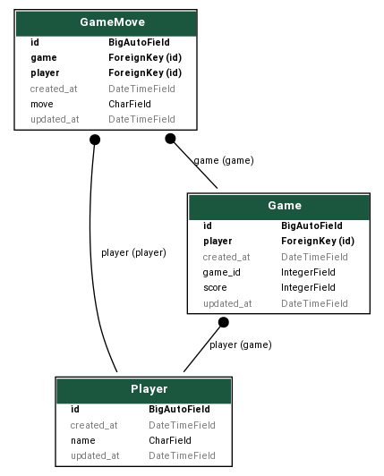

### Scope of the application
The project deals with implementing Rock Paper Scissors game. The rules of the game is shown in the image below (Source: Wikipedia):

#### Application Flowchart and Schema:
The flowchart below represents the flow of the game:
- We will have 2 modes - play with computer and play with player
- If computer mode is selected, the user will be playing with the computer which follows the logic of randomly selecting the options and matching it against the rules of the game and the user action selected.
- If player mode is selected, we take the username of player 2, take their inputs and make them select the option and the actions are then compared with the rules of the game to announce the verdict.
- Score board shows the scores of both the players for that game session. 

The database schema for the application is shown below:

Here, 3 tables have been used - 
- Player: to store player information
- Game : to store the game details - player and score
- GameMove: takes game id and player as foreign key and store the player moves during the game.

### Pre-requisites
- Python 3+ version (install from here -> https://www.python.org/downloads/)
- pipenv (Once python is installed, this can be installed by running `pip install pipenv`)
- git (install from https://git-scm.com/downloads)

### How to set up in local?
- Clone the project to your system using the command `git clone https://github.com/sukanya-pai/rock-paper-scissors.git`
- Go inside the project folder --> `cd rock-paper-scissors`
- Run `pipenv shell` --> A virtual environment will be created.
- Run `pipenv install` -->  The dependencies listed in Pipfile would be installed in the virtual environment
- Go inside the main app folder --> `cd rock-paper-scissors`
- To apply the database migrations from the migrations folder, run `python manage.py migrate`
    - Whenever any database changes are done, run `python manage.py makemigrations` to update the migrations and the run the migrate command.
- To start the server in your system, run `python manage.py runserver` 
- To access the application, use the URL --> http://localhost:8000/rock-paper-scissor/home --> once the server is running.

Additional:
- To generate DB schema in django for the existing models and apps, install django_extensions using `pip install django_extensions` and add django_extensions in INSTALLED_APPS of settings.py
    - Install graphviz, pydot to support graph generation of the db schema by running `sudo apt install python-pydot python-pydot-ng graphviz`
    - To get the database schema of entire django project, run the command: `python manage.py graph_models -a -g -o rps_schema.png`
    - To get the database schema of only specific app, run the command: `./manage.py graph_models two_player_game -o rps_schema.png` 
    - The schema would be generated in the project location. 

### What was achieved?
- In 3 hours:
    - Requirement freeze and database design plan exercise for two player game
    - Development of in memory game application - both UI and backend - which takes inputs from user, processes it and returns result and updates score board
        - While doing this encountered interesting issues in UI. Debugged it and fixed the issues.
    - Extending the in memory game to database based design to allow saving game data for future use.
    - Implemented backend for saving the data and encountered minor implementation related issues in django queries and worked on fixing it.
- Took additional 1-2 hours for the following:
    - Implemented About Page and Contact Us page to provide more details regarding the application in UI.
    - Noticed tight coupling in database design which didnt let the current design to be extended to n-player game without need for adding columns. Worked on revamping the database design schema and backend logic to support multi player approach for future. 

### Additional features that could be implemented if I had more time:
- Would have deployed the application on heroku. I have started going through heroku concepts and configuration steps for deploying the application. 
- Would have developed a page that displays detailed user statistics. Backend database stores data, just have to develop UI and logic to retrieve and display the data.
- Would have developed Login (Authorization) component for the application so that user could login to their profile and go to the game easily and keep track of everything that they were part of securely. Currently it is achieved by using just the usernames which wouldnt be secure as anyone with the user name can access the game if they had access to backend resources.
- Due to shortage of time, I have developed simple UI screen with some styles and features and focus was more on functionalities to be achieved. If there was more time, would have worked on beautifying the page with better visuals for score boards or for taking inputs. 
- Game room implementation for multiple players to join a room and then play in isolated environment. For example, currently, we take inputs from users one at a time considering that the link is accessed in one browser and two players are closeby. Having a room provides flexibility to user to access from different browsers and we do not have to show inputs selection of other players to a particular player. 