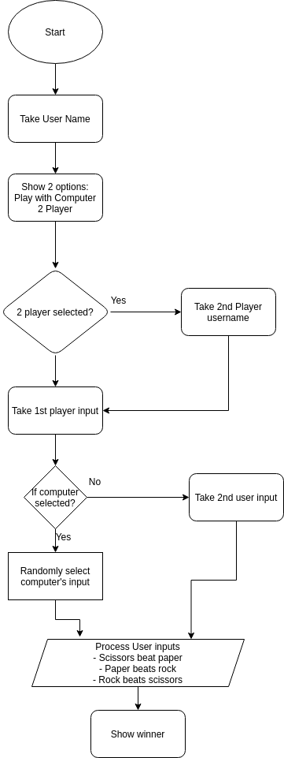

### Scope of the application
The project deals with implementing Rock Paper Scissors game. The rules of the game is shown in the image below:

Source: Wikipedia

The flowchart below represents the flow of the game:

- We will have 2 modes - play with computer and play with player
- If computer mode is selected, the user will be playing with the computer which follows the logic of randomly selecting the options and matching it against the rules of the game and the user action selected.
- If player mode is selected, we take the username of player 2, take their inputs and make them select the option and the actions are then compared with the rules of the game to announce the verdict.
- Score board shows the scores of both the players for that game session. 

### Pre-requisites
- Python 3+ version (install from here -> https://www.python.org/downloads/)
- pipenv (Once python is installed, this can be installed by running `pip install pipenv`)
- git (install from https://git-scm.com/downloads)

### How to set up in local?
- Clone the project to your system using the command `git clone https://github.com/sukanya-pai/rock-paper-scissors.git`
- Go inside the project folder --> `cd rock-paper-scissors`
- Run `pipenv shell` --> A virtual environment will be created.
- Run `pipenv install` -->  The dependencies listed in Pipfile would be installed in the virtual environment
- Go inside the main app folder --> `cd rock-paper-scissors`
- To apply the database migrations from the migrations folder, run `python manage.py migrate`
    - Whenever any database changes are done, run `python manage.py makemigrations` to update the migrations and the run the migrate command.
- To start the server in your system, run `python manage.py runserver` 
- To access the application, use the URL --> http://localhost:8000/rock-paper-scissor/home --> once the server is running.

